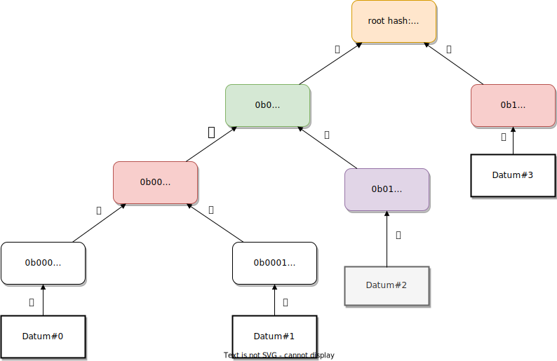

# NEAR Protocol Analysis

>The NEAR whitepaper can be found [here](#0).

#### Team
* Arthur Santos
* Leonardo Razovic
* Marijo Radman
* Sam Ruberti
* Thomas Pignard

### Outline
1. Cryptography
1. Economics
1. Governance
1. Blockchain Structure
1. Blockchain Guarantees
1. Threat Models
1. Conclusion

---
### Introduction
---

#### The Core Offerings of NEAR
NEAR is a community run blockchain-cloud that allows <b>developers</b> to sustainably build applications which secure high value assets while making them performant and infinitely scalable.

#### What Users Can Do
* Developers can build services in a permissionless environment and receive rewards when consumers interact with their applications.
* End users can interact with applications with fast transaction speeds and low fees, and they can stake their assets to earn rewards through Proof of Stake.

#### What Makes NEAR Unique
The economic model is the most original feature of NEAR. It is built around the developer first and introduces a deflationary mechanism for the token - a large portion of the transaction fees are burned. NEAR claims to be infinitely scalable and is built on a sharded, proof of stake, layer-one blockchain.

---

### 1. Cryptography

---

#### Digital Signatures

The accounts are protected by the use of digital signatures. NEAR supports accounts derived from a public/private key scheme based on either curve SECP256K1 or Ed25519 (dalek library).
The support of SECP256K1 is useful to maintain some compatibility layer with Bitcoin/Ethereum, but most of the operational participation to the chain protocol - such as staking - require Ed25519 accounts.
Those digital signatures are essential for authenticating that the origin of a transaction spending funds or authoring a block, for instance, really is in charge of the account allowed to perform this transaction, hence in control of the private key.

Since it is computationally infeasible to compute the private key from the public information all signatures are considered irrepudiable.

#### Accounts

Unlike many other blockchain projects, the accounts are not identified primarily by public key hashes that represent an address. Instead, NEAR defines the notion of an "account ID" that's a dot-separated, human-readable, string of characters, formatted in a similar way as URLs are. They also follow a hierarchy where postfixes represent a higher domain than prefixes[[1]](#1).
For instance, the "near" domain is active on the mainnet, and allows for accounts of the type: "alice.near". The owner of a given account ID could then define sub-accounts by prefixing them, e.g. tipping.alice.near could be used by Alice only to tip her friends.
Human readable accounts are a very nice feature of the protocol that improves usability by hiding addresses and obscure byte strings from users.
However, it comes with various costs: in particular, there is no direct cryptographic binding between a given public/private keypair and the account ID, without access to onchain data, unlike what's possible with addresses, that can be all derived offchain from a given keypair. Breaking this relationship also breaks the possibility to easily accommodate primitives like hierarchical key derivation schemes.
Lastly, the main drawback is maybe not so much cryptographic, but social: while it could appear nice to reserve account IDs following a given name on the near domain, the set of name is limited and cannot be re-used, forcing late users to rely on account IDs that - although human-readable - would be harder to relate to a given individual.
On the contrary, public key hashes are Global and Unique IDs that can then be linked to a human readable identifying string through a registrar. This combines the advantages of both uniqueness with human-readability, even though it forces the user to perform the registration.

Since the link between account IDs and keypairs is defined onchain, rather by cryptographic hashing, it becomes possible to link multiple keypairs to a given account ID[[2]](#2). By default, NEAR defines a full-access key that can perform any operation on an account, including sending funds. It is possible for users to define one or many so-called "FunctionCall" keys that are registered to perform calls to given functions only, with specific token allowances. This is not dissimilar to the distinction that substrate makes between stash and controller keys, excepted that the FunctionCall keys are more specialised hence that many of them can be defined depending on the functions to be called as part of a given users routine and the allowances needed.

#### Hash functions

Like any blockchain, NEAR makes extensive uses hash functions and hash-based data structures.
For most of its operations, NEAR relies on a single hash function, (SHA2-256), which is used for most of the primitives including hashing for the Merkle tree representations, hashing of contract code, etc.
They also use Blake2b in a specific case related to how they generate a randomness beacon. This is discussed in more details below.
The possible downsides of the choice for SHA2-256 as the main hash function are that it is not as efficient as the Blake2/Blake3 family and even more compared to algebraic hashing functions in case the cryptographic guarantees are not needed, and that it is an older hash function that doesn't likely provide the same level of security as Blake2/3 or Keccak.
Yet, the bitcoin network in particular has been instrumental in popularizing implementation and hardware research for this specific hash function, in a way that probably makes it the most standard to date.

Cryptographic hashing is the foundation for two sets of data structures in NEAR explained in the following two sections.

#### Merkle-Patricia Tries

The state of the blockchain, including accounts, code and data for contracts, access keys and receipts, is stored within multiple Merkle Patricia Tries. The merkleized structure ensures that the state cannot be tampered with without changing the root of the tree. The tree roots are included into blocks, enshrining a given representation of the state on which the consensus agreed.

<p align = "center">

</p>
<p align = "center"><b>
The Merkle path for datum #2 consists of the datum node hash (purple) together with the path itself in green and the root.
</b></p>
<p align = "center"><b>
The Merkle proof for datum #2 consists of the datum node hash (purple) together with the path conodes in pink and the root.
</b></p>

One of the nice properties of the Merkle tries is that their root is a compact commitment to all nodes. In particular, they allow for average (in case the trie is balanced) $log(n)$ sized Merkle proofs that any given node is included. NEAR dedicates a specific structure to store those proofs called a __Partial Merkle Tree__, meant to store only the path to the last included element, and updates the proof accordingly on each new insertion.

In practice the state in NEAR is represented by multiple Merkle tries: one for the previous state root, and one trie of all the previous block hashes up to the current one, and one for the outcome of all transaction and receipts[[3]](#3). In addition, Merkle tries are used to record respectively the hash of the transactions for each shard chunk, the hash of the receipts, the hash of the headers for each shard chunk and the hash of the potential onchain challenges against double signing[[4]](#4).

#### Hash lists

The chain itself is a hash list, where each block refers to its parent by including the parent's header hash in its own header. It ensures that an older block cannot be tampered with without invalidating all the subsequent blocks.

<p align = "center">

</p>

Besides those basic primitives that can be found at the foundation of most blockchains, NEAR uses also a set of bleeding edge primitives.

#### Erasure coding

In NEAR, erasure coding is baked into the consensus itself to ensure data availability: each validator of a shard sends erasure coded data to validators from other shards. This part is crucial to ensure that if a given shard gets taken over by a malicious set of actors, the rest of the chain remains able to detect that the proofs are fake.
The scheme used ensures that only $1/3^\textrm{rd}$ of the validators can reconstruct data for all shards, which remains robust in case $1/3^\textrm{rd}$ of the nodes are split from the network and another $1/3^\textrm{rd}$ is malicious.
The data availability is enforced at consensus level, by forcing validators to check whether the data is available before they accept a block.

#### Signature Agregation: BLS signatures and Multisignatures

In NEAR, validators sign the blocks but verifying all those signatures would be prohibitively expensive for a node syncing the chain. Instead, __BLS signatures__ are used, and block producers are collecting those signatures and aggregate them using the properties of the BLS signatures. The block producer then publishes the aggregated signature together with a Merkle root of the individual signatures organized into a Merkle tree, and signs this using a cheap ECDSA scheme.
When syncing the chain, participants can then choose to skip the validation of all individual signatures and verify only the ECDSA signature from the validator, relying on the fact that he has neither been challenged and slashed.
Moreover, in order to ensure compatibility with Ethereum, NEAR requires at least every block beginning an epoch (and optionally other blocks) to contain a __Schnorr aggregated multisignature__ of all the individual validators signatures. Since the Schnorr aggregation is interactive, it cannot be conducted too frequently, but it allows for efficient validations on other chains like Ethereum, so that a state can be verified full at such "snapshot blocks".

#### Verifiable random functions

NEAR's new random beacon makes use of a VRF to generate randomness that's both unpredictable and unbiasable[[5]](#5). A reliable randomness beacon is an important piece of tool of modern blockchains, and can be used both in the consensus level (e.g. to select validators in an unpredictable way, preventing them to get targeted in advance by malicious actors), or as a tool for higher level applications, for instance as a seed to be used whenever smart contracts require some unbiasable and unpredictable source of randomness.

Their new randomness beacon is based on BLS signatures, and allows any given subset $k < n$ of $n$ nodes to produce unpredictable and unbiasable randomness without any node set of size $k-1$ being able to learn any information about the randomness beacon.
In practice, NEAR choses $k = (2/3) . n$ to increase the difficulty for a subset of malicious and colluding participants to reveal the randomness, as long as at least $1/3^\textrm{rd}$ of the participants are honest.
Those properties are trivial consequences of the features of BLS signatures and cryptographic pairings, that require a distributed key generation protocol.
The way this protocol is conducted is worth some note:
NEAR is relying on the linearity of polynomials to aggregate point evaluations of polynomials of degree $k-1$ by each participants into point evaluations of a sum polynomial of degree $k-1$ that the protocol agrees on.

Each validator $v$ generates a secret polynomial $P$ and sends to each other validator $w$ the evaluation of their secret polynomial to a given point $x_w$, encrypted on the elliptic curve: $P(x_w).H$, all encrypted with $w$'s public key so that only the recipient validator can know that point.
However there is a caveat in that each recipient $w$ of an evaluation at $x_w$ from validator $v$ is responsible for checking its correctness and challenge it within a given time period (half a day, or one epoch) if incorrect.
This is weaker than if the correctness of the computed point could directly be enforced onchain (see [[5]](#5)).

The distributed key generation protocol is conducted once per epoch and the VRF is jointly evaluated at every block height to generate a random number.
The process above involves many specific hash functions in NEAR, aside from the SHA2-256 discussed earlier.
The group of prime order is the Ristretto255 group, and the Hash-to-point and scalar modulo hashing algorithm are respectively Blake2b with 64 bytes output converted to a point using the Ristretto map, and Blake2b with 32 bytes output modulo the group order.

The proof of correctness for polynomials involves another hash function where the input of Blake2b with 32 bytes output is fed to ChaCha20/20 and the output is chunked into 32 bytes blocks that are used to produce k outputs. This effectively spreads out the number of bits of randomness, but it may not be a problem since the k outputs are all used to build a single challenge.

There may be an ambiguity introduced by the fact that NEAR uses ED25519 Keypairs, and that there is no well-defined way of converting ED25519 points to Ristretto. The choice they made was just to directly re-interpret the bytes.

#### Succint Non-interactive ARguments of Knowledge

The current implementation of NEAR still relies on fishermen to ensure the security of shards (refer to the description of the consensus). This is a __fraud proof approach__, that is cheap and easy to implement but bears the downside of negatively impacting liveness and speed of the protocol due to the challenge period, as well as introducing the questions about incentivization of the fishermen.
To address those issues, NEAR is planning to switch to a __validity proof approach__ where each chunk producer would produce a zero knowledge succint proof attesting of the chunk validity. This proof would be small and cheap to verify. However, they are still costly to compute so remain untractable in a network that expects a very low block time as NEAR. With the acceleration of the research and discoveries on new more efficient zkSNARKs, it may become possible for NEAR to switch in the future, and this is one of the directions they are actively looking at[[6]](#6).

>#### What We Like
>
> 1. NEAR uses (or has a roadmap for the use of) a full set of powerful and bleeding edge primitives. This allows them to remain competitive with the best technical projects in the space, even though exotic cryptographic primitives may be a double-edge sword as they are less battle-tested.
> 2. NEAR's use of erasure coding to solve the data availability issue, over the use of some set of notaries that are trusted to keep long term data.
> 3. The new randomness beacon based on threshold randomness that allows the protocol to use unbiasable and unpredictable randomness for every validator selection, as opposed to round-robin based mathods that could be biased by non-revealing.
> 4. The use of BLS aggregation of the signatures, which is elegant and efficient for a large number of validators. The use of Schnorr to ensure maximal compatibility with popular chains like Ethereum.

> #### What We Don't Like
>
>1. Most of the structures rely on SHA2-256 as a hash function, which is older and slower than Blake2b, while Blake is already used by the protocol for Hash-to-point functions in the new randomness beacon implementation.
>2. Unlear path towards the use of zkSNARKs to provide security based on validity proofs as opposed to fraud proofs. The current challenge/response mechanism affects the protocol liveness and can be gamed by using briberies to modify the incentives to report fraud.
>3. At the moment, the protocol is in a phase where some of the design decisions are half baked: the use of BLS aggregation is nice as it would allow for a potentially very large pool of validators to get their signatures aggregated and then validated cheaply. However, with only 100 validators, at the time of writing, it may not really be optimal. Yet if the number of validators increases, the Schnorr interactive aggregation phase may become unpractical on the other hand.

---
### 2. Economics
---

#### Native Currency - NEAR Token
$NEAR (Ⓝ) is the native cryptocurrency used in NEAR Protocol and, as the lifeblood of the network, has several different use cases. As the native currency, it secures the network, provides a unit of account and medium of exchange for native resources and third-party applications, and, over the long term, aims to become a unit used by individuals as well as by contracts and decentralized finance (DeFi) applications.

##### Security of the Network
NEAR Protocol is a proof-of-stake network which means that Sybil resistance from various attacks is done by staking Ⓝ. Staked Ⓝ represent a “medallion” for service providers that supply a decentralized infrastructure of servers that are maintaining state and processing transactions to NEAR users and applications. In exchange for this service, node providers receive rewards in Ⓝ.

##### Network usage fees
Ⓝ is used as collateral for storing data on the blockchain. Having 1 Ⓝ on an account allows the user to store some amount of data (the specific amount depends on the available storage but will increase over time).

##### Medium of exchange 
Because Ⓝ is readily available on the protocol level, it can be easily used to transfer value across NEAR applications and accounts. This monetary function enables the creation of applications that use Ⓝ to charge for various functions, access to data, or performing other complex transactions. 

##### Unit of Account
Applications and external parties can use Ⓝ as a unit of account for their application services or to measure the amount of the exchange in cases of Ⓝ as medium of exchange.

#### Token Distribution
At the genesis block there were 1 billion NEAR Tokens created. The tokens were allocated to individuals and organizations on an ongoing basis during the rollout of MainNet which started on October 13, 2020

| Allocation of Genesis Tokens       | Percentage     | Vesting / Lockup
|--------------|----------- |-----------
| Core Contributors | 14.0% | 12 Lockup / Vesting 48 Months
| Small Backers | 6.1% | 24 Months Vesting
| Backers | 17.6% | 24 to 36 Months Vesting
| Community Sale | 12.0%| 12 Months Vesting
| Foundation Endowment | 10.0% | 48 Months Vesting
| Operations Grants | 11.4% | 60 Months Vesting
| Early Ecosystem | 11.7% | 48 Months Vesting
| Community Grants, Programms.. | 17.2% | 60 Months Vesting

*Source: see [[7]](#7) https://near.org/blog/near-token-supply-and-distribution/*

The lockup phase for the backers was in most cases 24 Months, except the Series A Round with 36 Months. That means with the current NEAR Token price of $4.5, the backers have a ROI of 20-120X depending in which state the token was bought. That means that there is high incentive for the backers to cash out and the selling pressure is expected to last until October 2023. 


#### Economic Ecosystem
NEAR creates a market between four main players: *developers*, *validators*, *token holders*, and the *treasury*. As with most blockchains good behavior is rewarded and bad behavior is punished, but NEAR also rewards quality code contributions to the ecosystem. Namely, rewarding developers for contributing frequently used contracts.

#### Developer Business Model
Perhaps one of the most unique features of NEAR is the ability to earn rewards as a developer. Developers are rewarded for contributing meaningful code the the ecosystem and are rewarded with 30% of all transaction fees for calls to their code. There is a risk, however, of too many developers flooding the network with inferior services and flooding the network in hope of rewards. To mitigate this NEAR requires a developer wallets to maintain a balance proportional to the storage used in their applications. Any poorly performing contract will cost a developer money and would therefore have a short life on chain. 

Another interesting feature of this economic incentive is the minimum reward. We already said that the 30% reward for developers. In economic behavior theory *Perfect Competition* describes a market where there are many firms and many buyers and no one has a monopoly or oligopoly. No firm is this model is profitable, but instead breaks even as they struggle to provide the product that everyone wants. This is a theoretical baseline. NEAR raises this baseline from 0 to 30% to strongly incentivize developers to add value to the market.

NEAR relies on *economic specialization* of developers to add value to the ecosystem at a faster rate than their development team can. Their treasury is largely dedicated to on-boarding builders through grants.

#### Validators
As a “Proof of Stake” system, the NEAR platform is secure because the validators who run nodes put some of their tokens at stake as a kind of deposit to guarantee good behavior and for validator selection (prevent Sybil attack). Should these validators produce an invalid block or create an alternative chain (eg. with the goal of creating a double spend), they will be “slashed”, cutting this deposit.

Validators are chosen based on the “Thresholded Proof of Stake” model which uses an auction to determine how many “seats” will be allocated to each prospective validator (by determining the minimum threshold number of tokens for a single seat).  This auction is designed to provide fair (equal opportunity) allocation and allow as many people as possible to participate in the network’s validation process so it can achieve meaningful decentralization. A validator can deterministically expect to participate in the validation process in a proportion that matches their proportion of total stake in the network. A given validator may become one of several possible roles:

1. Block Producer
2. Chunk Producer
3. Hidden Validator

Independent of the role the validator is assigned, its reward will be proportional to the percentage of the total amount staked by the validator.  This means there is no need to pool stake under the minimum required to become a validator.

“Hidden Validators” are validators who are selected from the general validator pool and are assigned to validate shards that are unknown to any parties except themselves.  This process ensures that it is extremely difficult to successfully corrupt a sufficient number of nodes to perform malicious behaviors in a shard.
Hidden Validators are compensated for validating and signing off on the validity of chunks and blocks as a normal part of the validator compensation process.

“Fishermen” are observing nodes who permissionlessly detect and report bad behavior.  These nodes are synced with the network but are not necessarily participating in the consensus and don’t actually get paid for any specific ongoing activity.  They can include wallet operators, application developers or exchange infrastructure. These nodes validate parts of the chain that are important to them and, if they detect issues, they can flag those issues via challenge. To prevent “griefing” of challenges, a small bond of 10 NEAR must be posted ahead of time.

The system does not provide any reward for operating a node as a Fisherman (there is no reward for sending a successful challenge). Instead, participants who run a Fisherman node generally have outside motivations for maintaining the security of the network.

There are two major types of malicious behaviour possible on the NEAR platform:

1. Double Signing: Signing two or more different blocks at the same height.
2. Invalid Chunks: Signing a chunk with an invalid data or computational result. 

Malicious validators might double sign because they are trying to execute a chain reorganization which reverts certain transactions (which might allow them to conduct a “double spend” as a result). 

To balance the risk of accidental slashing, NEAR uses “Progressive slashing”.  This is where the portion of stake that is slashed is a multiple of the amount of stake that exhibited the double signing behavior during the epoch in question.  This multiple is 3, so each malicious participant gets slashed by 3 * malicious_stake / total_satake.

For an invalid chunk, the full stake of the validator gets slashed.  This is because an invalid chunk is only possible if the node is actually malicious (they have modified the code)


#### Token Holders
Token holders may choose not to participate in the staking process, for example because they are only temporary holders, they are providing liquidity for trading markets or they simply prefer not to participate.  Token holders who do not participate in the staking and validation process receive no additional benefits from the operation of the network itself, though their tokens have utility by powering storage of the data and their usage of applications running on the network.

#### Treasury
To enable continued community growth and evolution of protocol, part of the inflation (10% of the inflation, or a total of 0.5% annually per initial parameters) is allocated to Protocol Treasury.


#### Inflation
NEAR Protocol’s issuance of tokens, or inflation, is necessary to pay network operators, also called Validators. There is fixed issuance around 5% of the total supply each year, 90% of which goes to Validators in exchange for computing, storage, and securing the transactions happening on the network. 

All transaction fees collected by the network get burned. Therefore, the issuance of Ⓝ is actually ~5% minus transaction fees. This means that, as the network grows in usage, issuance can become negative, introducing negative inflation in the protocol. Since the smallest unit of account for Ⓝ is yocto Ⓝ, the system can keep its exchange price resolution as small as infinitesimal fractions of the U.S. dollar, even with a reduction of the overall supply by two or three orders of magnitude.


| tx/day         | NEAR mints / day     | Annual Inflation |
|--------------|-----------|------------|
| 1,000 | 136,986 | 5.000%
| 1,000,000 | 136,886 | 4.996%
| 1,500,000,000 | -13,014 | -0.475%
| 2,000,000,000 | -63,014 | -2.300%

*Source: see [[8]](#8) https://near.org/blog/near-protocol-economics*

#### Rewards
The rewards are a combination of coinbase (new native tokens minted) and transaction fees.
NEAR is doing their logic on an ”epoch” level, and validators get elected and rotated every N blocks. Because of this they also define rewards per epoch. At the end of every epoch, the rewards are then distributed between Validators, Developers and the Protocol Treasury.
Total epoch reward can be calculated as:
$$
epochReward_t = coinbaseReward_t + epochFees_t
$$
where $epochFees$ is combination of all the fees collected during the blocks of the epoch t, and include transaction fees and state rent. Note, that $epochFees$ do not contain part of user paid fees that were allocated to an application directly.

There is a ceiling for the maximum coinbase and dynamically decreases the coinbase depending on the amount of total fees in the system. This ensures a minimum epoch reward, and with growth in usage, reduces inflation.
To calculate the actual coinbase reward, first the maximum inflation per epoch has to be calculated:

$$
maxCoinbase=totalSupply_t(\sqrt[numEpochsPerYear]{1+maxInflation} - 1)
$$
Where
$$
totalSupply_t=initialSupply+\sum_{i=0}^{t-1}coinbaseReward_i
$$
, meaning it is the total number of tokens in the system at a given epoch t.
Given $maxCoinbase$, the $coinbaseReward$ for given epoch $t$ can be calculated:

$coinbaseReward_t = \left\{ 
  \begin{array}{ c l }
    0 & \quad \textrm{if } epochFees_t \geq maxCoinbase \\
    maxCoinbase - epochFees_t                 & \quad \textrm{otherwise}
  \end{array}
\right.$


This means, that if the total fees for a given epoch are greater than the maximum coinbase, the fees themselves provide sufficient incentive and the actual coinbase for that epoch can be zero. Otherwise, total fees will decrease inflation by the corresponding amount.

#### Transaction fees
Each transaction has a few different components that make up its cost: the cost for receiving and transmitting the transaction (bandwidth), the cost for processing (especially if this is a complicated state transition / smart contract) (CPU) and the cost for state storage (for keeping the information going forward).
Because computation and bandwidth can be charged simultaneously on a per-transaction basis they can be combined into one scalar, usually known as a transaction fee, denoted as $txFee_{index}$

Computation and bandwidth are combined into one scalar, usually referred to as ”gas” and defines how many resources are used per transaction.
The exact relationship between 1 CPU instruction and 1 byte of bandwidth is left to implementation details, but the general idea is that total ”gas” of given transaction can be computed as:

$$
\begin{equation}
gas_{tx}=numberOfCPUInstructions(tx)+\alpha \cdot SizeOf(tx),
\end{equation}
$$

where $\alpha$ is the relative relation between a unit of computation and a unit of bandwidth. Usually this value is constant (and can be adjusted via governance if it changes drastically). And $SizeOf(tx)$ is the size of the transaction in bytes sent over the wire (i.e. bandwidth).
Each transaction must specify the amount of gas it needs as part of the transaction data. This allows block producers to roughly estimate the amount of gas that will be used when the block will be executed before they actually do it (e.g. as they first must produce a block and only then will execute it).
This amount can be an over-estimation of expected gas usage because the unused amount will be returned to the payer of the transaction after all transactions are completed (all receipts finished across all shards). If a transaction doesn’t attach enough gas to execute a required function, the transaction will terminate early and fail, but still charge for spent gas.

#### State Storage

Because storage is a fundamentally difference resource from computation and bandwidth (whereas those costs are one-time burdens on validators and other nodes) state space must be stored going forward across all the nodes.
Because of this, storage is usually a mispriced resource. If it is paid only once at the inclusion of the transaction – the reward goes to the block producer but requires all other nodes going forward to store information. It’s especially true in the case of Bitcoin, where it’s expected that every node maintains full UTXO history but only the miner that included it receives the reward.
To solve this problem, for each block time each account is charged $StoragePrice \cdot SizeOf(account)$ tokens, where $SizeOf(account)$ is size of the account in bytes.

If account’s balance goes below $minBalance = pokeThreshold \cdot storagePrice \cdot SizeOf(account)$ anyone can send a special transaction that clears state from this account. As a reward the steward gets some pokeReward of the remaining balance on the account. Next few rules also apply:
+ If a transaction would bring the balance below $minBalance$, by either moving money or increasing size of the account, this transaction considered failed.
+ If this account is staking, e.g. has staked > 0, a $minBalance$ of $4 \cdot epochLength \cdot storagePrice \cdot SizeOf(account)$ is required. If at the epoch boundary validator has $balance < minBalance$, their proposal or rollover will not be accepted. Instead of updating balance every step, which is impractical, the accounts are updated only when they are already changed by some transaction:

Each account has a $StoragePaidAt$ field. Current balance is then calculated
$$
\begin{equation}
balance − StoragePrice \cdot SizeOf(account) \cdot (curBlock−StoragePaidAt)
\end{equation}
$$
When account is modified, the size of the state and update balance is recomputed by the given formula above, setting $StoragePaidAt$ at the current block.
Even though cost on storage may change over time, this is a slow process and can be addressed by a network participants decision (through a governance process).
On the other hand, there is volatility in the price between a native token and underlying price that validators pay (and users/developers expect).
In this work, the $StoragePrice$ is set as constant and postpone exploration to address volatility to future work.
****

#### How does this project use economic incentives to drive behavior?

###### Auctions
NEAR Protocol uses human-readable account names. The distribution of the short names is done through naming auctions.
Also, the redistribution of the validator seats is done through a simple auction to determine the seat price.

###### Market Equilibrium (Supply and Demand)
The token supply schedule, inflation & deflation and coin usage  is described in detail at the beginning of this chapter.

###### Game Theoretical Models
The Validators are slashed for bad behavior (see "Validators" chapter) and rewarded for good behavior. From the game theoretical point of view the validators do not have any rational reason to misbehave in the network.

Tragedy of the Commons states that over consumption of a common good by an individual inflicts damage on the community. Over fishing, for example, provides the optimal benefit for the individual, but decreases the total fish population. In NEAR storage is a common good and there is a risk of developers flooding blockchain storage with applications. NEAR mitigates this by requiring developers to maintain a wallet balance in proportion to the storage that their applications consume. This inflicts an opportunity cost because wallet balances cannot be staked and must suffer the loss of the current inflation rate. In addition, the total number of applications a developer can release is limited to their budget. Useful applications will pay for themselves through transaction fees, or other business models，and useless applications will simply cost money. This mechanism protects the common good and enforces quality control over application services.

###### Economic Specialization
Developers are rewarded for contributing meaningful code to the ecosystem. By using their competitive advantage they are able to generate additional profit for themselves. Through this mechanism devs are  incentivized to specialize on the near protocol. Additionally, community grants will ensure additional specialization in the areas which are important for the long-term development of the protocol.


>#### What We Like
>1. The lockup and vesting schedule of the team and founders is very fair. They have a long term commitment to the project, which will bring the most quality to the project over the five years. They also took a small percentage of the overall token distribution and probably deserved more! (The reason is probably that they raised money in a bear market).
>2. All incentives are dynamic based on blockchain activity and token inflation. In theory the system will balances itself into equilibrium and encourage quality user experiences and applications. One example of dynamic adaptation is in the changing inflation rate of block rewards based on total transactions per day. Another example is in the validator auction process where the minimum threshold for validator entry into the pool is deliberately lowered to allow the most possible candidates.

>#### What We Don't Like
>1. NEAR took a lot of investments giving investors 24% of the tokens in addition to another 12% in community sales. This amount is unsual. There is also no lockup schedule for investors and only 24-36 months vesting schedule. The investors therefore do not have a long time incentive for the project and it puts selling pressure on the entire ecosystem in the early stage. In addition, the inflation is not put on the investors, which means that the community pays for the block rewards. We feel that the investors got a free ride and their rewards were unfairly balanced.
>2. The guard against the Tragedy of the Common good (See Game Theory Models above) is only as strong as the current inflation rate. With 2 billion transactions per day the effective inflation rate would be -2.3%, meaning the value of NEAR tokens are increasing if held in a wallet. In this situation there is a risk of more applications flooding the market and using up storage without a cost to useless applications. We would add a linear payment mechanism to developers based on storage size if inflation dropped below 1% to make storage a little more "painful." The performance of the application itself would need to be exceptional to justify its existence.

---


### 3. Governance

---

**What are the structures of governance in this project? How are changes proposed and voted on?**

All discussions regarding any proposals take place in the [NEAR Governance community](https://gov.near.org/), that acts as a forum for the community to discuss topical NEAR protocol improvements and governance initiatives.
Technical changes to the protocol are called NEAR Enhancement Proposals, NEPs. They are ultimately done via pull requests to [this](https://github.com/near/NEPs) repository. The procedure for proposing a change is as follows: 
* Sign up for the NEAR Governance community site and make a post to the appropriate section.
* The forum has comment threading which allows the community and NEAR Collective to ideate, ask questions, wrestle with approaches, etc.
* When the governance conversations have reached a point where a clear plan is evident, the person proposing the change must make a pull request, following a precise set of instructions:
	+ NEP Editors check document *formatting*, *completeness* and *adherence* to [NEP-0001](https://github.com/near/NEPs/blob/master/neps/nep-0001.md) and approve the pull request. (NEP editors don't pass philosophical judgment on NEPs. They merely do the administrative & editorial part.)
	+ The author updates the NEP status to **Review** allowing further community participation, to address any gaps or clarifications, normally part of the Review PR.
	+ NEP Editors mark the NEP as **Last Call**, allowing a 14 day grace period for any final community feedback.
	+ NEP Editors mark the NEP as **Final**, marking the standard as complete

**Who is allowed to vote in this project? What are the voting criteria?**

NEAR’s governance defines a **Reference Maintainer**, which is an entity responsible for **technical upgrades** to the NEAR network. This entity has been selected to maintain the **Reference Implementation** and continue to suggest improvements to the specification.
All major releases will be protected with community discussion and a veto process (a 2 week challenge period), while smaller bug fixes can be rolled out fast and delivered to node operators. Initially, the Maintainer is selected by the Foundation Board and serves until the board votes to replace them. 

**What voting mechanisms are used in this project?**

At NEAR they use the protocol version to specify the version of the blockchain protocol and is separate from the version of some specific client (such as `nearcore`), since the protocol version defines the protocol rather than some specific *implementation* of the protocol. More concretely, for each epoch, there is a corresponding protocol version that is agreed upon by validators through a voting mechanism. Three different levels of upgradability are:
+ Updating without any changes to underlying data structures or protocol;
+ Updating when underlying data structures changed (config, database or something else internal to the node and probably client specific);
+ Updating with protocol changes that all validating nodes must adjust to.

There are 2 different important versions:
+  Version of binary defines its internal data structures / database and configs. This version is client specific and doesn't need to be matching between nodes.
+  Version of the protocol, defining the "language" nodes are speaking.

Clients can define how the current version of data is stored and migrations applied. The general recommendation is to store the version in the database and on binary start, check the version of the database and perform required migrations. Their upgrade scheme dictates that protocol version $X$ is backward compatible with protocol version $X-1$, so that nodes in the network can seamlessly upgrade to the new protocol. However, there is no guarantee that protocol version $X$ is backward compatible with protocol version $X-2$. To make protocol upgrades more robust, they introduce the concept of a nightly protocol version together with the protocol feature flags to allow easy testing of the cutting-edge protocol changes without jeopardizing the stability of the codebase overall.
Since Genesis Block to date, the protocol has been updated 25 times. [source](https://explorer.near.org/stats)

**How does this project solve the collective decision making problem?**

NEAR Protocol didn't implement any meaningful collective decision structure yet, as their focus lies (at the moment) on the development of their protocol. Usually, centralized teams are faster in delivering and we assume this was the reasoning why they neglected governance at this stage of the project. If they want to be competitive with other protocols they will have to improve on this part and learn from the competitors (e.g. Polkadot)

>#### What We Don't Like
>1. The *Reference Maintainer* is a centralized entity that can have the final say on the direction of the project. The  Reference Maintainer is elected by NEAR Foundation and because of that, we're asking ourselves what's the difference between a Web 2.0 company and NEAR Protocol? We assume and hope that the governance structure will improve over the next few years. 
>2. The NEAR Governance forum is the focal point of discussions and is run by the NEAR Foundation, so we have to trust them. There is no real on-chain mechanism to vote and submit new proposals. Since everything is offchain there is a risk of manipulation about the voting outcome as centralized entities are used to store the results.

>#### What We Like
>1. If we really have to report something positive, at least the NEAR Governance forum is public and no registration is required to read the content. (Unlike services like Discord for example).
>2. At least they know that their governance structure is not good. Usually, the first step toward improvement is realizing your weaknesses. In their whitepaper is written that they're gonna improve the governance system.
---

### 4. Blockchain Structure

---
**What is the consensus algorithm that is used? How does it work?**

Consensus is achieved across all of the nodes which make up the network operators across all of the shards using the **Nightshade** algorithm. In contrast to other systems where sharding is performed Nightshade assumes that all of the shards combine to produce a single block, and each block "contains" all the transactions for all the shards. The "heaviest chain" method is used to reach consensus:
+ When a block producer produces a block, they collect signatures from other block producers and validators attesting to the previous block.
+ The "weight" of a block is the cumulative stake of all the signers.

Because the system uses Proof-of-Stake, both block producers and validators have a certain amount of internal currency frozen for a period of time far longer than the time they spend fulfilling their obligations of generating and validating the chain. There are no shard chains in Nightshade; instead, all block producers and validators are working together to create a single blockchain, which we refer to as the *main chain*. Each block producer and validator at any given time only has locally downloaded a subset of the state that corresponds to some subset of the shards, and only processes and validates transactions that affect those parts of the state.

The block producers download the state of the shard they're assigned to before the epoch (an epoch lasts about 15 hours), and through the epoch collect transactions that affect that shard, and applies them to the state. For each block $b$ on the main chain and for every shard $s$ there is one of the assigned block producers to $s$ who is responsible to produce the "part" of $b$ related to $s$, this part is called **chunk** and contains the list of the transactions for the shard to be included in $b$, as well as the Merkle root of the resulting state. $b$ will ultimately only contain a very small header of the chunk, namely the Merkle root of all the applied transactions, and the Merkle root of the final state.

<p align = "center">

</p>
<p align = "center"><b>
On the left is a classic example of shard chains; on the right we have a representation of the single chain in Nightshade
</b></p>

Blocks are produced with a regular cadence (more-or-less 1 second) regardless of whether each shard has produced its chunk for that specific block height.
The block producers have an order and repeatedly produce blocks in that order: e.g. if there are 100 block producers, the first block producer is responsible for producing blocks 1, 101, and 201.
The chunk producers only choose which transactions to include in the chunk but do not apply the state transition when they produce a chunk (transactions are applied only when a full block that includes the chunk is processed). Correspondingly, the chunk header contains the Merkle root of the merkelized state as of before the transactions in the chunk are applied.
The transactions are only applied when a full block that includes the chunk is processed. A participant only processes a block if:
1. The previous block was received and processed;
2. For each chunk the participant doesn’t maintain the state for they have seen the onepart message;
3. For each chunk the participant does maintain the state for they have the full chunk.

Once the block has been processed for each shard that the participant manages the state for, they compute the new state after the transactions have been applied, and then, if they are assigned to any shard, they are prepared to produce the chunks for the next block since they have the Merkle root of the new merkelized state. If a transaction needs to affect more than one shard, it needs to be consecutively executed in each shard separately.
The full transaction is sent to the first shard affected, and once the transaction is included in the chunk for such shard, and is applied after the chunk is included in a block, it generates a so-called *receipt transaction*, that is routed to the next shard in which the transaction needs to be executed. If more steps are required, the execution of the receipt transaction generates a new receipt transaction, and so on.
The lifetime of the receipt is the following:
+ **Producing and storing the receipts**: The chunk producer $cp_a$ for shard $a$ receives the block $A$, applies the transaction $t$ and generates the receipt $r$.
+ **Distributing the receipts**: Once $cp_a$ is ready to produce the chunk for shard $a$ for block $B$, they fetch all the receipts generated by applying the transactions from block $A$ for shard $a$, and included them into the chunk for shard $a$ in block $B$.
+ **Receiving the receipts**: When applying the state transition for a particular shard, the participant applies both the receipts that they have collected for the shard in the onepart messages, as well as all the transactions included in the chunk itself.


#### Doomslug
+ Throughout this section we assume that there’s a total of $n = 2t + 1$ block producers, of which $t + 1$ are honest, online and follow the protocol, while the remaining $t$ can be offline or arbitrarily deviate from the protocol.
+ In Doomslug each block has a height $h$, and each height $h$ has a particular block producer who is assigned to produce a block at $h$.
    +  We denote the **block proposer** for $h$ as $BP(h)$.
+ Whenever a block $B$ is produced at height $h$, it is broadcast by $BP(h)$ to all other block producers.
+ Once a particular block producer $p$ (other than $BP(h)$) receives $B$, they create an endorsement message $E(B, p)$, unless they previously promised to skip endorsing height $h.$
+ The block proposer for height $h + 1$ cannot produce their block unless they have messages $E(B,p)$ from at least $t + 1$ block producers.
+ Given some function $T(x)$ each block producer that didn’t receive the block for height $h+1$ after time $T(1)$ sends another message $S(h+1, 1, p)$ to $BP(h+2)$ which indicates that $p$ suggests to skip $1$ block starting at height $h + 1$, and promises not to endorse any block at height $h+1$.
+ The block proposer $BP(h+2)$ for height $h+2$ can produce their block if they collect $t+1$ messages $S(h+1, 1, p)$.
+ If some block $B'$ is produced at height $h + 1$ after some block producers started sending $S(h + 1, 1, p)$, the block producers that sent $S(h + 1, 1, p)$ cannot send $E(B', p)$, that would constitute a slashable behavior.
+ If some block $B_{h+1}$ includes $t + 1$ messages $E(B_h, p)$ for its previous block $B_h$, then $B_h$ is final in a sense that reverting it would require at least one block producer committing a slashable behavior.
+ Doomslug allows the network to continue producing and finalising blocks as over half of the validator set are online and honest (As opposed to many other consensus algorithms that require 2/3 of online and honest validators), but the finality stalls if less than 2/3 of participants are online.

The fields in the Block header relevant to the consensus process are:
```rust
struct BlockHeader {
    ...
    prev_hash: BlockHash,
    height: BlockHeight,
    epoch_id: EpochId,
    last_final_block_hash: BlockHash,
    approvals: Vec<Option<Signature>>
    ... 
```
Block producers in the particular epoch exchange many kinds of messages. The two kinds that are relevant to the consensus are Blocks and Approvals. The approval contains the following fields:
```rust
enum ApprovalInner {
    Endorsement(BlockHash),
    Skip(BlockHeight),
}

struct Approval {
    inner: ApprovalInner,
    target_height: BlockHeight,
    signature: Signature,
    account_id: AccountId
}
```
Where the parameter of the `Endorsement` is the hash of the approved block, the parameter of the `Skip` is the height of the approved block, and `target_height` is the specific height at which the approval can be used (an approval with a particular `target_height` can be only included in the approvals of a block that has `height = target_height`), `account_id` is the account of the block producer who created the approval, and `signature` is their signature on the tuple `(inner, target_height)`.

**What are the core elements of the application stack?**

Here is the high-level diagram of various runtime components, including some blockchain layer components:


The runtime crate encapsulates the logic of how transactions and receipts should be handled. If it encounters a smart contract call within a transaction or a receipt it calls `near-vm-runner`, for all other actions, like account creation, it processes them in place. `near-vm-runner` is a wrapper around [Wasmer 2](https://github.com/wasmerio/wasmer) that does the actual execution of the smart contract code. It exposes the interface provided by `near-vm-logic` to the smart contract. `near-vm-logic` instead describes the interface that smart contracts use to interact with the blockchain. Encapsulates the behavior of the blockchain visible to the smart contract, e.g. fee rules, storage access rules, and promise rules.

**What is the anatomy of a block in this system?**

The block is mainly composed of a `BlockHeader` and a vector of *chunks* from the different shards.
```rust
#[derive(BorshSerialize, BorshDeserialize, Debug, Clone, Eq, PartialEq)]
pub struct BlockV2 {
    pub header: BlockHeader,
    pub chunks: Vec<ShardChunkHeader>,
    pub challenges: Challenges,

    // Data to confirm the correctness of randomness beacon output
    pub vrf_value: near_crypto::vrf::Value,
    pub vrf_proof: near_crypto::vrf::Proof,
}
```

The header in turn is also a wrapper that obviously contains the hash of the previous block, the signature of the person who produced the block, the hash of the current block, and two different sub-`struct`: `BlockHeaderInnerLite` (which contains information to the operation of light clients) and `BlockHeaderInnerRest`.
```rust
#[derive(BorshSerialize, BorshDeserialize, Serialize, Debug, Clone, Eq, PartialEq)]
#[borsh_init(init)]
pub struct BlockHeaderV3 {
    pub prev_hash: CryptoHash,

    /// Inner part of the block header that gets hashed, split into two parts, one that is sent
    /// to light clients, and the rest
    pub inner_lite: BlockHeaderInnerLite,
    pub inner_rest: BlockHeaderInnerRestV3,

    /// Signature of the block producer.
    pub signature: Signature,

    /// Cached value of hash for this block.
    #[borsh_skip]
    pub hash: CryptoHash,
}
```
Light Clients only read the `inner_lite` struct, where they find all the essential metadata.

```rust
#[derive(BorshSerialize, BorshDeserialize, Serialize, Debug, Clone, Eq, PartialEq)]
pub struct BlockHeaderInnerLite {
    /// Height of this block.
    pub height: BlockHeight,
    /// Epoch start hash of this block's epoch.
    /// Used for retrieving validator information
    pub epoch_id: EpochId,
    pub next_epoch_id: EpochId,
    /// Root hash of the state at the previous block.
    pub prev_state_root: MerkleHash,
    /// Root of the outcomes of transactions and receipts.
    pub outcome_root: MerkleHash,
    /// Timestamp at which the block was built (number of non-leap-nanoseconds since January 1, 1970 0:00:00 UTC).
    pub timestamp: u64,
    /// Hash of the next epoch block producers set
    pub next_bp_hash: CryptoHash,
    /// Merkle root of block hashes up to the current block.
    pub block_merkle_root: CryptoHash,
}
```
The other metadata needed for the doomslug finality and BFT finality instead are in the `inner_rest` struct.
```rust
#[derive(BorshSerialize, BorshDeserialize, Serialize, Debug, Clone, Eq, PartialEq)]
pub struct BlockHeaderInnerRestV3 {
    /// Root hash of the chunk receipts in the given block.
    pub chunk_receipts_root: MerkleHash,
    /// Root hash of the chunk headers in the given block.
    pub chunk_headers_root: MerkleHash,
    /// Root hash of the chunk transactions in the given block.
    pub chunk_tx_root: MerkleHash,
    /// Root hash of the challenges in the given block.
    pub challenges_root: MerkleHash,
    /// The output of the randomness beacon
    pub random_value: CryptoHash,
    /// Validator proposals.
    pub validator_proposals: Vec<ValidatorStake>,
    /// Mask for new chunks included in the block
    pub chunk_mask: Vec<bool>,
    /// Gas price. Same for all chunks
    pub gas_price: Balance,
    /// Total supply of tokens in the system
    pub total_supply: Balance,
    /// List of challenges result from previous block.
    pub challenges_result: ChallengesResult,

    /// Last block that has full BFT finality
    pub last_final_block: CryptoHash,
    /// Last block that has doomslug finality
    pub last_ds_final_block: CryptoHash,

    /// The ordinal of the Block on the Canonical Chain
    pub block_ordinal: NumBlocks,
    pub prev_height: BlockHeight,
    pub epoch_sync_data_hash: Option<CryptoHash>,

    /// All the approvals included in this block
    pub approvals: Vec<Option<Signature>>,

    /// Latest protocol version that this block producer has.
    pub latest_protocol_version: ProtocolVersion,
}
```

**What is the state transition function of this blockchain/project?**

The state transition function consists of the following stages:
+ Snapshot the initial state.
+ Apply validator accounts update, if available.
+ Convert new signed transactions into the  `Receipts`.
+ Process `Receipts`.
+ Check that incoming and outgoing balances match.
+ Finalize trie update.
+ Return `ApplyResult`.
    
All cross-contract communication in NEAR happens through `Receipts`. `Receipts` are stateful in the sense that they serve not only as messages between accounts but also can be stored in the account storage to await `DataReceipts`. Each `Receipt` has a `predecessor_id` (who sent it) and `receiver_id` the current account

>#### What We Like
>1. Choosing to use WebAssembly at runtime allows for excellent performance, but more importantly, being platform agnostic allows for deterministic instruction execution. Determinacy is required by blockchains to provide trustworthy state transition updates across all peers in the peer-to-peer network without requiring that everyone run identical hardware. This allows developers to write contracts in both Rust but also in AssemblyScript (A TypeScript-like language for WebAssembly), this could incentivize new developers who know JavaScript/TypeScript but are scared of Rust.
>2. The block creation method and the finality device are divided, so we have an *hybrid consensus*. Combining these two processes enables NEAR to build blocks quickly while allowing the slower finality mechanism to operate in a separate process to finalize blocks without running the risk of stalling or slower transaction processing.

>#### What We Don't Like
>1. It is possible with Nightshade that there are too many receipts that target a specific shard in a specific block to be processed. The time it takes from the creation of the receipt to the application can keep becoming longer and longer if the system is under an unbalanced load for an extended period of time.
>2. A chunk can be invalid and therefore a challenging period was implemented. In particular, the destination shard of any cross-shard transaction cannot be certain the originating shard chunk or block is final until the challenge period is over. The existence of the challenge protocol (*Fisherman*) creates a new vector of attacks when malicious nodes spam with invalid challenges.


---


### 5. Blockchain Guarantees

---


#### Liveness: "something good will eventually occur"

#### Under the use of doomslug in a scenario where we have $n = 2t + 1$ block producers

Under partially synchronous network assumption from any reachable state of the system for as long as at least t + 1 honest block producers are online, a block will be produced in finite time.
Those producers need to produce attestations or skip messages.

```python
def get_approvals(self, target_height):
    return [approval for approval
                     in self.approvals
                     if approval.target_height == target_height and
                        (is instance(approval.inner, Skip) and approval.prev_height == self.head_height or
                         is instance(approval.inner, Endorsement) and approval.prev_hash == self.head_hash)]
```


#### Under nightshade finality gadget in a scenario where we have $n = 3f + 1$ block producers
Under partially synchronous network assumption from any reachable state of the system for as long as at least $2f + 1$ honest block producers are online, a block will be finalized in finite time.

We assume that every message sent before GST (Global Stabilization Time) between any honest block will be delivered after GST and messages sent after GST will be delivered within GST. 
$$
\begin{aligned}
\forall q &: \exists x: T(x) \geq q \wedge \\ \forall x \mid x \geq 2 &: T(x) \geq T(x-1)
\end{aligned}
$$
A Block B has a doomslug finality once a block producer saw another block producer that's producing a different block and was seen by this block producer. If this Block producer time is t+1 (ahead of the first block producer time) it can be considerer a  witness of the honesty of the producer. What makes doomslug finality irreversible unless one of the producers is not considered honest.

#### Fisherman
Whenever a block header is communicated between chains for any purpose, there’s a period of time during which any honest validator can provide a proof that the block is invalid. There are various constructions that enable very succinct proofs that the blocks are invalid, so the communication overhead for the receiving nodes is way smaller than that of receiving a full block.
With this approach for as long as there’s at least one honest validator in the shard, the system is secure.


***_Lemmas and theorems_***
- For any height $h$, at least one block at height $h' > h$ will be produced after GST.
- Let Be be the block with largest height he that has doomslug finality at some point in time. Consider some height h for which an honest block producer p sent a skip message. For any height h  0 < h it must be that either p sent an endorsement message on some block at h0, or sent a skip message that promises to skip h0, or observed a block with a height hb, h0 < hb < h. If a message to endorse or skip h 0 was indeed sent, unless block with higher height than he has doomslug finality at some point, the time that passed between sending an endorsement or a skip on h0 and sending a skip for h is at least T(h − he)
- Let Be be the block with largest height he that has doomslug finality at some point in time. Unless another block with higher height has doomslug finality at some point, if an honest block producer p sent a skip message for height h such that T(h−he) > 8∆ at time t0, no later than t0 − 7∆ all honest block producers have either sent a skip message promising to skip h − 1, or an endorsement on some block a height h − 1.
- Let Be be the block with largest height he that has doomslug finality at some point in time. Unless another block with higher height has doomslug finality at some point, there’s exists a height h 0 such that for any height h > h0 with T(h − he) > 8∆, a block will be produced as long as the BP(h) is online and honest.


***_Block Production Gadget Liveness._***

For any height $h$, at least one block at height $h' > h$ will be produced after GST that has doomslug finality.


#### Fairness

Now, near validators are required to have an 8-core CPU, 1TB of SSD and it implies a cost of 330 USD/month in cloud providers. The minimum threshold is actually 67,000 in NEAR token (aprox. 300.000 USD) A big improvement considering they were running on a 3.6M USD threshold in the end of 2020. However, they’re already late on their milestones of having 200 validators in early 2022. 

Each witness seat is defined by the stake of all participants that indicated they want to be signing blocks. For example, if 1,474,560 participants stake 10 tokens each, then each individual seat is worth 10 tokens and each participant will have one seat. Alternatively, if 10 participants stake 1,474,560 tokens each, individual seat still cost 10 tokens and each participant is awarded with 147,456 seats. Formally, if $X$ is the seat price and {Wi} are stakes by each individual participant:


$$
\begin{equation}
\max(x) \in N \cdot \sum_{W_i\geq X} \left\lVert \frac{W_i}{x}\right\rVert \geq 1474560
\end{equation}
$$

Now, those 100 validators in proof of stake are working on 295.000 daily in a PoS environment. 
The main advantages of this mechanism for electing witnesses are:

- No pooling necessary
- Less forking
- Security

***Disavantages***

Witnesses are known well in advance so an attacker could try to DDoS them. In our case, this is very difficult because a large portion of witnesses will be on mobile phones behind NATs and not accepting incoming connections. 

Attacking specific relays will just lead to affected mobile phones reconnecting to their peers. In PoS, total reward is divided between current pool of witnesses, which makes it slightly unfavorable for them to include new witnesses. In our approach we add extra incentives for inclusion of new witness transactions into the block.


#### Censorship Resistance
To remain decentralized, it’s important that a community-run system like this be permissionless. In a centralized system, elements like titles or assets are highly sensitive. They store some important information that can be used to both censor or manipulate data. Elements like:

 - ***The platform where the data is stored***
 - ***The developer who controls the release or update of the application’s code***
 - ***The servers which run the application’s code***

are easily accessible by governments or dictators and can be manipulated in favor of the manipulator.

NEAR plans to implement a fully decentralized network where all peers are anonymous and the network is controlled by tokens owners, that are going to vote to reach a consensus amongst them. 
NEAR counts with the “advantage" of using shards to scale in a partially synchronous network. 

Besides bringing problems to the blockchain structure, specially the communication between shards (intended to be solved by nightsharding) It theoretically can help the network to scale infinitely, once that some are splitted while other are reduced.

```rust
pub struct ShardChunkHeaderV3 {
    pub inner: ShardChunkHeaderInner,

    pub height_included: BlockHeight,

    /// Signature of the chunk producer.
    pub signature: Signature,

    #[borsh_skip]
    pub hash: ChunkHash,
}

impl ShardChunkHeaderV3 {
    pub fn init(&mut self) {
        self.hash = Self::compute_hash(&self.inner);
    }

    pub fn compute_hash(inner: &ShardChunkHeaderInner) -> ChunkHash {
        let inner_bytes = inner.try_to_vec().expect("Failed to serialize");
        let inner_hash = hash(&inner_bytes);

        ChunkHash(combine_hash(&inner_hash, inner.encoded_merkle_root()))
    }

    pub fn new(
        prev_block_hash: CryptoHash,
        prev_state_root: StateRoot,
        outcome_root: CryptoHash,
        encoded_merkle_root: CryptoHash,
        encoded_length: u64,
        height: BlockHeight,
        shard_id: ShardId,
        gas_used: Gas,
        gas_limit: Gas,
        balance_burnt: Balance,
        outgoing_receipts_root: CryptoHash,
        tx_root: CryptoHash,
        validator_proposals: Vec<ValidatorStake>,
        signer: &dyn ValidatorSigner,
    ) -> Self {
        let inner = ShardChunkHeaderInner::V2(ShardChunkHeaderInnerV2 {
            ...
        });
        let hash = Self::compute_hash(&inner);
        let signature = signer.sign_chunk_hash(&hash);
        Self { inner, height_included: 0, signature, hash }
    }
}
```


``` rust
pub fn data_shard_count(&self) -> usize { self.rs.data_shard_count() } 
pub fn total_shard_count(&self) -> usize { self.rs.total_shard_count() }
```


It allows, using Nightshade, that each participant of network to be responsible for creating and validating just a small amount of data. What makes the process of running a single node less expensive and more democratic.


#### Safety: "something bad does not occur"

#### Finality Gagdget Safety

block producers committed a slashable act, or a block heavier than w(b1) that is not in the ancestry of b1 was finalized by another block producers set.

If a block b1 is finalized on one chain, no heavier block can get a quorum pre-vote on any other chain

#### Under the use of doomslug in a scenario where we have $n = 2t + 1$ block producers
Under partially synchronous network assumption from any reachable state of the system for as long as at least t + 1 honest block producers are online, a block will be produced in finite time.


#### Under Nightshade finality gadget in a scenario where we have $n = 3f + 1$ block producers
A finalized block cannot be reverted unless at least one third of the total stake of all the block producers is slashed. Or, in other words, unless f block producers are slashed.

A honest block producer can never produce two endorsements with the same `prev_height` (call this condition conflicting endorsements), neither can they produce a skip message s and an endorsement e such that `s.prev_height < e.prev_height` and `s.target_height >= e.target_height` (call this condition conflicting skip and endorsement).

#### Finality condition
A block $B$ is final in $chain(T)$, where $T \ge B$, when either $B=G$ or there is a block $X \le T$ such that $B=prev(prev((X))$ and $h(X) = h(prev(X)) +1 = h(B)+2$. That is, either $B$ is the genesis block, or $chain(T)$ includes at least two blocks on top of $B$, and these three blocks ($B$ and the two following blocks) have consecutive heights.


>#### What We Like
>1. Doomslug provides liveness guarantess even in case where finality stalls due to more than $33\%$ of the validators missing.
>2. The requirements to run a validator are reasonable, which helps to preserve censorship resistence by allowing censored parties to join the consensus if needed.


>#### What We Don't Like
>1. The number of validators is also very small and makes the network partially centralized. 
>2. The NEAR foundation is still too powerful. This may result in a censorship possibility.
---


### 6. Threat Models and Security

---

NEAR has been designed with careful consideration of the threat model of blockchains in mind, and as such offers an attractive set of security guarantees. However practical considerations and shortcuts have sometimes been used and are weakening up the overall security design.

The security of the user account balances relies on digital signatures as most of the blockchains do, we already reviewed the different schemes supported and analyzed the way accounts are used and generated in part 1, dedicated to cryptography.
However, as soon as a user submits a transaction, the thread model changes since the transaction is then executed on behalf of the user by a distributed state machine, and it is crucial to ensure that all possible attacks or issues that could prevent a correct execution of the protocol are addressed. In this part, we are focusing only on this, and not on issues arising from a misuse of the protocol by a given user, or by the security of its personal setup.

The origin of the transaction is enforced by a digital signature associated with the account that initiated the transaction. When such transaction is submitted to the protocol, it can be included by a chunk producer and executed on a given shard. Many treat can affect a trustless system when performing those operations:

### Byzantine generals problem

In a distributed environment where participants don't know each other, a consensus needs to be reached even in the presence of a set of unknown malicious actors, without the help of a central authority.
This coordination problem is sometimes referred to as the _Byzantine generals problem_. Consensus protocols in blockchains are primarily designed to tackle it.
As previously reviewed, NEAR's consensus agreement relies on two different parts for their protocol: a block production mechanism called __"Doomslug"__ , which ensures reliable block candidates can get produced without too much overhead, and a finality gadget called __"Nightshade"__. Nightshade is effectively the part that addresses the problem of the Byzantine generals, and like many proof of stake finality mechanisms, relies on a logic founded on PBFT[[9]](#9). A subset of participants called "validators" is responsible for reaching a consensus on the state of the system at a given time, and those validators are untrusted and distributed. Nightshade, provides similar guarantees as PBFT, but also suffers the same drawbacks, namely: the protocol is secure as long as $2/3^\textrm{rd}$ of the validators are honest, but relies on two rounds of message passing with a complexity on in $O(n^2)$ for a number $n$ of validators, making it increasingly difficult to keep a low block time as the number of validators gets higher.
More importantly, if $1/3^\textrm{rd}$ of the participants of the protocol drop out, the protocol stalls.
This is the main reason behind the separation of the block production function from the finality function: it allows for the chain to keep on producing blocks, albeit with lower security guarantees, and to finalize them independently when possible. If too many validators go offline, the finality of the chain would stall without being critical for the liveness. Users accepting to deal with a lower security threshold (only the block producer would get slashed in case of malicious behaviour) would be mostly unaffected, while others happy to wait for finalization could still submit their transactions and get them processed, providing they would wait for finalization to get triggered again.

### Sybil attacks

The protocol relies on the assumption that a sufficient number of participants are honest. This affects both the block production mechanism, in which at least $51\%$ of the block producers need to be honest, and the finality gadget, which requires a threshold of $2/3^\textrm{rd}$ honest validators to be online. This makes it crucial to prevent a malicious actor to secure many validator slots (in NEAR, block producers are chosen within the set of validators, so it is sufficient to ensure the set of validators is difficult to get corrupted). Yet, as the system is pseudonymous, nothing prevents an adversary to create multiple accounts.
To prevent Sybil attacks, NEAR relies on the fact that a sufficient amount of tokens need to be bounded for a validator to get a slot. As long as the token maintains sufficient value, it becomes expensive to create accounts that are funded enough to participate to the protocol.
At the moment of writing, the lower staked validator slot has got for 180 000 NEAR tokens, so around $750 000 equivalent.

### $51\%$ Attacks

> **NB:**  By $51\%$ attack we mean the procedure bywhich an adversary could take over the network, not necessarily that a threshold of $51\%$ would be required to do so, as we know that the real threshold in most blockchains is in fact lower, e.g. selfish mining in bitcoin etc.

NEAR uses a proof-of-stake algorithm where the security of the network depends on the amount of tokens that get staked (bonded) by the validators and the validator candidates. The security of the system can then be assessed in terms of a financial quantity in FIAT currency (e.g. USD) depending on the price of the token at a given point in time.

As the proof-of-stake protocol design in NEAR relies on different algorithms with different properties, we can look at them individually to assess the security of all parts, then most critical applications should base their threat model on the weakest part of the protocol, while less important or financially attractive transactions could be happy to consider a less conservative tradeoff.

### Finality

In NEAR, any attack that takes over the finality mechanism is fatal, therefore it is sufficient to take over the nightshade finality algorithm to fully compromize the chain. As previously discussed, Nightshade offers the same guarantees as PBFT, which means that $2/3^\textrm{rd}$ of the validators need to be honest to finalize a block. However, we know that the theoretical security threshold is half of this since, in case of a perfect network partition of honest validators, $1/3^\textrm{rd}+1$ malicious actors could join any of the two (remaining $1/3^\textrm{rd}$) parts of the segregated honest validator pool and be in a majority there.
__The theoretical security is then equal to the cost of taking other the $1/3^\textrm{rd}+1$ least bonded validators.__

### Block production

As previously exposed, the doomslug algorithm is ensuring the chain will go on as long as at least $51\%$ of the validators are online to endorse a block, since each block producer needs to collect sufficient endorsement messages (or skipping messages if the previous block was not produced) to be allowed to produce its own one. It means that a block producer controlling less than $51\%$ of the stake would not be allowed to produce blocks that are accepted by other participants. Over $51\%$ of the stake, a malicious block producer could produce an invalid block and get it endorsed, but it would not be sufficient to get it finalized, since $67\%$ of the validators are then required to finalize it. The block producer would then be exposed to fishermen that submit fraud proofs and get him slashed. Before finalization, the level of security of a single block is effectively only equal to the stash value of the block producer. After finalization, it is equal to $1/3^\textrm{rd}$ of the stake (since no mechanism is ensuring the stake of different validators is homogeneous), the lower bound is actually only the total stake of the least bonded validator. 

### Shard security

NEAR is a shared blockchain (although at the time of writing, the network still operates on a single shard, we analyze the situation from a theoretical standpoint following the specifications in the nightshade paper XOX as if multiple shards were in use), so the security guarantees are different.
Within one shard (defined in NEAR as a sequence of chunks within the main block), if the majority of the validators gets corrupted, the shard itself can be fully taken over, and validators could endorse an invalid state. Effectively, other validators on other shard are only operating a light-client equivalent verification on the corrupted shard, so they run the risk of getting inter-shard transactions coming from a corrupted shard affected, spreading the state corruption to other shards and eventually to the whole network.
Fishermen are meant to address this problem: by incentivizing them to publish onchain challenges attesting from the invalidity of a given block shard, they allow the state to be reverted to the one just before the shard corruption in case of a successful shard attack on a block. This means that finalization is optimistic, and can theoretically get reverted, (at the cost of $1/3^\textrm{rd}$ of the bonded stake).

### Adaptive corruption

One important attack vector on blockchains that cannot scale infinitely the number of validators is the possibility for adaptive corruption, i.e. the possibility for a malicious party to bribe or corrupt only a specific subset of the actors in order to take over the network, or grief other participants.
In NEAR, this problem is addressed partly by using the randomness beacon to assign validators to shards, and also by the use of "hidden validators" whose assignment to any given shard is never released publicly, making it impractical to find out who should be corrupted.
However, at the full chain level, the block producers are operating in following a round robin, so attacks such as DDOSing a particular producer becomes easier, and the validators are rotated once every epoch (15 hours), so any block that would be challenged within that period would let the set of validators exposed for the rest of the epoch.

### More practical considerations

NEAR currently operates only on one shard and with 100 validators. Nothing is put in place to ensure that the stake are evenly distributed so there are huge differences between stakes, with the most bonded validator getting bonded for 25 000 000 NEAR tokens and the least bonded being worth only 180 000 NEAR tokens. It makes taking over the least slots relatively cheap if considering the security of a 4B USD network (at the time of writing, the price of the NEAR token is around 4.2USD)
Worse, taking over the last 34% of the validators and being in a theoretically able to take over the whole network requires only 11.5M NEAR tokens, which is less than 50M USD.
The liveness and security of the protocol can also be badly impacted by the fact that there is no punishment for being offline during block production, other than the loss of the block reward.

>#### What We Like
>
>1. NEAR is aware of and has addresses the different security challenges posed by proof-of-stake consensus based blockchains, albeit not always in an optimal manner.
>2. Consensus separation in block production and finality that favours liveness while still maintaining PBFT security for mission critical usecases that can trade a higher speed for added security.
>3. The problem of shard corruption spreading out being addressed through a clever use of randomness and hidden validators, with Fishermen being the end guardians.

>#### What We Don't Like
>
>1. Nothing is done to ensure the stakes of the validators are homogenized, leading to as system where the worst case security bound is practically very low even though the total bonded is reasonably high.
>2. The use of round robin for the main block production, allowing for a malicious actor to adaptively bribe, grief, DDoS, of more generally attack validators following their turns.
>3. In case a bad block is challenged, the validators would be uncovered till the end of the epoch.
>4. No offline penalties apart from the missing reward.

---

### 7. Conclusion

---

**How do the cryptographic elements, the economic incentives and the blockchain parameters all contribute to the core goals of this blockchain?**

NEAR leverages a set of the best cryptographic techniques to support their vision of a fully scalable sharded blockchain. From unbiasable randomness to efficient signature aggregation for shards; together with a cleverly designed consensus method that allows preserving the security guarantees of PBFT while keeping the chain optimistically producing blocks in case finality cannot be reached immediately.

The data availability challenge for shards is solved by embedding erasure coding schemes within the protocol itself, in that validators would not accept a block for which they haven't received their erasure-coded chunk data part.

Some mechanisms such as the cross-shard transaction validation still rely on fraud proofs rather than validity proofs and are expected to be secured by economically incentivized fishermen that would detect and challenge invalid state transitions. This weakens the security of the protocol and its liveness, since there is always a possibility that no fisherman would come up to challenge an invalid transition if the challenge period is too low, and the protocol would be unable to decide on what blocks cannot be rolled back for a long period of time if the challenge period is too high.

The incentives to run the protocol as defined are ensured by a punishment/reward mechanism whereby honest participants get rewarded with tokens, and malicious participants get their bond slashed.
However, the fact that offline behavior is not punished may negatively impact the liveness guarantees of the protocol.

The validator auction process with a minimum treshold for validator entry into the pool is deliberately lowered to allow the most possible candidates. 

Additional incentives (e.g. developers incentives), in combination with an user centric approach, are implemented to accelerate the adoption of the NEAR protocol.

**Of the things that you identified you liked the _most_, what were the two top things you would highlight?**

>1. An allocation of 30% of transaction costs to developers is a unique way how to attract talent to work on the protocol. This design feature could accelerate the adoption of NEAR Protocol and differentiate NEAR from the competition in the future.
>2. A UX centric approach that focuses not only on introducing new users to the network, but to make Web3 more democratic. Things such as human readable wallet addresses are one of the very prominent details that can be found on NEAR. The possibility of using Rust | AssemblyScript | Solidity to start creating on NEAR is a powerful tool for attracting non-crypto natives to the NEAR environment.

**Of the things that you identified you liked the _least_, what were the two top things you would highlight?**

>1. We believe that a Layer 1 protocol, on which assets in billions, are transferred on a daily basis should not have a centralized entity like "the reference maintainer" who is able to decide by himself about the direction of a protocol. 
>2. Cross-shard transactions are executed optimistically until challenged by fishermen if originating from an invalid block. If this happens, the chain gets rolled back to a previously valid state, potentially invalidating a full set of transactions happening within the challenge period. According to the nightshade paper, NEAR regards this as an "extremely rare event", which is a very dangerous assumption.

**Describe a way you would devise an attack on this system.**

#### Economic attacks

+ 750k USD is enough to take on a block producer slot and start to produce invalid blocks (though with the probability to get slashed)
+ ~45M USD is enough to take over the network fully.
+ Since there is no penalty for offline behavior, bribing current validators to get offline and take over their slots with a lower stake bounded only costs the rewards for each validator in theory.
#### Adaptive attacks

+ Targetting the main block producers one by one as they follow a round robin (e.g. DDoS)
+ In a sharded environment producing a fake block to uncover the validators first at the beginning of an epoch and later target all the validators of that block for the rest of the epoch.
#### Opportunistic attacks

+ In a sharded environment, taking over a shard and issuing cross-shard (cross-chunk) transactions to corrupt other chunks would be punished only if fishermen possess the minimal amount of state $L_s$ required to produce a challenge.

# References

<a id="0">[0]</a> https://near.org/papers/the-official-near-white-paper

<a id="1">[1]</a> https://docs.near.org/concepts/basics/account

<a id="2">[2]</a> https://www.near-sdk.io/zero-to-hero/beginner/logging-in

<a id="3">[3]</a> https://github.com/near/nearcore/blob/master/core/primitives/src/block_header.rs#L22

<a id="4">[4]</a> https://github.com/near/nearcore/blob/master/core/primitives/src/block_header.rs#L122

<a id="5">[5]</a> https://near.org/blog/randomness-threshold-signatures/

<a id="6">[6]</a> https://near.org/downloads/Nightshade.pdf (section 2.4)

<a id="7">[7]</a> https://near.org/blog/near-token-supply-and-distribution/

<a id="8">[8]</a> https://near.org/blog/near-protocol-economics

<a id="9">[9]</a> Miguel Castro and Barbara Liskov: _Practical Byzantine Fault Tolerance_  https://pmg.csail.mit.edu/papers/osdi99.pdf