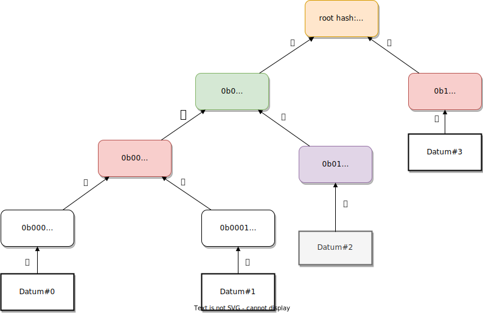
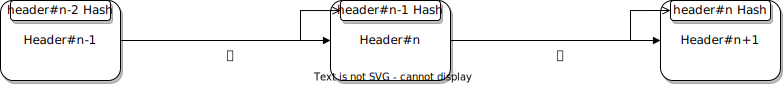

## Digital Signatures

The accounts are protected by the use of digital signatures. Near supports accounts derived from a public/private key scheme based on either curve SECP256K1 or Ed25519 (dalek library).
The support of SECP256K1 is useful to maintain some compatibility layer with bitcoin/ethereum, but most of the chain operations - such as staking - only support Ed25519 accounts.
Those digital signatures are essential for authenticating that the origin of a transaction spending funds or authoring a block, for instance, really is in charge of the account allowed to perfom this transaction, hence in control of the private key.
Since it is computationally infeasible to compute the private key from the public information (one-wayness), anybody able to sign a transaction with a give account as origin has to be in control of some private key linked to this account.

### Accounts

Unlike many other blockchain projects, the accounts are not identified primarily by public key hashes that represent an address. Instead, Near defines the notion of an "account ID" that's a dot-separated, human-readable, string of characters, formatted in a similar way as URLs are. They also follow a hierarchy where postfixes represent a higher domain than prefixes[[1]](#1).
For instance, the "near" domain is active on the mainnet, and allows for accounts of the type: "alice.near". The owner of a given account ID could then define sub-accounts by prefixing them, e.g. tipping.alice.near could be used by Alice only to tip her friends.
Human readable accounts are a very nice feature of the protocol that improves usability by hiding addresses and obscure byte strings from users.
However, it comes with various costs: in particular, there is no direct cryptographic binding between a given public/private keypair and the account ID, without access to onchain data, unlike what's possible with addresses, that can be all derived offchain from a given keypair. Breaking this relationship also breaks the possibility to easily accommodate primitives like hierarchical key derivation schemes.
Last the main drawback is maybe not so much cryptographic, but social: while it could appear nice to reserve account IDs following a given name on the near domain, the set of name is limited and cannot be re-used, forcing late users to rely on account IDs that - although human-readable - would be harder to relate to a given individual.
On the contrary, public key hashes are Global and Unique IDs that can then be linked to a human readable identifying string through a registrar. This combines the advantages of both uniqueness with human-readability, even though it forces the user to perform the registration.

Since the link between account IDs and keypairs is defined onchain, rather by cryptographic hashing, it becomes possible to link multiple keypairs to a given account ID[[2]](#2). By default, Near defines a full-access key that can perform any operation on an account, including sending funds. It is possible for users to define one or many so-called "FunctionCall" keys that are registered to perform calls to given functions only, with specific token allowances. This is not dissimilar to the distinction that substrate makes between stash and controller keys, excepted that the FunctionCall keys are more specialised hence that many of them can be defined depending on the functions to be called as part of a given users routine and the allowances needed.

## Hash functions

Like any blockchain, Near makes extensive uses hash functions and hash-based data structures.
For most of its operations, Near relies on a single hash function, chosen to be SHA2-256, which is used for most of the primitives including hashing for the Merkle tree representations, hasing of contract code, etc.
They also use blake2b in a specific case related to how they generate a randomness beacon. This is discussed in more details below.
The possible downsides of the choice for SHA2-256 as the main hash function This is not as efficient as the Blake2/Blake3 family and even more compared to algeabraic hashing functions in case the cryptographic guarantees are not needed.
It is also an older hash function that doesn't likely provide the same level of security as Blake2/3 or Keccak, but the bitcoin network in particular has been instrumental in popularizing implementation and hardware research for this specific hash function, in a way that probably makes it the most standard to date.

Cryptographic hashing is at the base of two sets of data structures in Near:

### Merkle-Patricia Tries

The state of the blockchain, including accounts, code and data for contracts, access keys and receipts, is stored within multiple Merkle Patricia Tries. The merkleized structure ensures that the state cannot be tampered with without changing the root of the tree. The tree roots are included into blocks, enshrining a given representation of the state on which the consensus agreed.

<b>
The Merkle path for datum #2 consists of the datum node hash (purple) together with the path itself in green and the root.
</b>

<b>
The Merkle proof for datum #2 consists of the datum node hash (purple) together with the path conodes in pink and the root.
</b>

One of the nice properties of the Merkle tries is that their root is a compact commitment to all nodes. In particular, they allow for average (in case the trie is balanced) $log(n)$ sized Merkle proofs that any given node is icluded. Near dedicates a specific structure to store those proofs called a __Partial Merkle Tree__, meant to store only the path to the last included element, and updates the proof accordingly on each new insertion.

In practice the state in Near is represented by multiple Merkle tries: one for the previous state root, and one trie of all the previous block hashes up to the current one, and one for the outcome of all transaction and receipts[[3]](#3). In addition, Merkle tries are used to record respectively the hash of the transactions for each shard chunk, the hash of the receipts, the hash of the headers for each shard chunk and the hash of the potential onchain challenges against double signing[[4]](#4).

### Hash lists

The chain itself is a hash list, where each block refers to its parent by including the parent's header hash in its own header. It ensures that an older block cannot be tampered with without invalidating all the subsequent blocks.

Besides those basic primitives that can be found at the foundation of most blockchains, Near uses also a set of bleeding edge primitives.

## Erasure coding

In Near, erasure coding is baked into the consensus itself to enshrine data availability: each validator of a shard sends erasure coded data to validators from other shards. This part is crucial to ensure that if a given shard gets taken over by a malicious set of actors, the rest of the chain remains able to detect that the proofs are fake.
The scheme used ensures that only $1/3^\textrm{rd}$ of the validators can reconstruct data for all shards, which remains robust in case $1/3^\textrm{rd}$ of the nodes are split from the network and another $1/3^\textrm{rd}$ is malicious.
The data availability is enforced at consensus level, by forcing validators to check whether the data is available before they accept a block.

## Verifiable random functions

Near's new random beacon makes use of a VRF to generate randomness that's both unpredictable and unbiasable[[5]](#5). A reliable randomness beacon is an important piece of tool of modern blockchains, and can be used both in the consensus level (e.g. to select validators in an unpredictable way, preventing them to get targeted in advance by malicious actors), or as a tool for higher level applications, for instance as a seed to be used whenever smart contracts require some unbiasable and unpredictable source of randomness.

Their new randomness beacon is based on BLS signatures, and allows any given subset $k < n$ of $n$ nodes to produce unpredictable and unbiasable randomness without any node set of size $k-1$ being able to learn any information about the randomness beacon.
In practice, Near choses $k = (2/3) . n$ to increase the difficulty for a subset of malicious and colluding participants to reveal the randomness, as long as at least $1/3^\textrm{rd}$ of the participants are honest.
Those properties are trivial consequences of the features of BLS signatures and cryptographic pairings, that require a distributed key generation protocol.
The way this protocol is conducted is worth some note:
Near is relying on the linearity of polynomials to aggregate point evaluations of polynomials of degree $k-1$ by each participants into point evaluations of a sum polynomial of degree $k-1$ that the protocol agrees on.

Each validator $v$ generates a secret polynomial $P$ and sends to each other validator $w$ the evaluation of their secret polynomial to a given point $x_w$, encrypted on the elliptic curve: $P(x_w).H$, all encrypted with $w$'s public key so that only the recipient validator can know that point.
However there is a caveat in that each recipient $w$ of an evaluation at $x_w$ from validator $v$ is responsible for checking its correctness and challenge it within a given time period (half a day, or one epoch) if incorrect.
This is weaker than if the correctness of the computed point could directly be enforced onchain (see [[5]](#5)).

The distributed key generation protocol is conducted once per epoch and the VRF is jointly evaluated at every block height to generate a random number.
The process above involves many specific hash functions in Near, aside from the SHA2-256 discussed earlier.
The group of prime order is the Ristretto255 group, and the Hash-to-point and scalar modulo hashing algorithm are respectively Blake2b with 64 bytes output converted to a point using the Ristretto map, and Blake2b with 32 bytes output modulo the group order.

The proof of correctness for polynomials involves another hash function where the input of Blake2b with 32 bytes output is fed to ChaCha20/20 and the output is chunked into 32 bytes blocks that are used to produce k outputs. This effectively spreads out the number of bits of randomness, but it may not be a problem since the k outputs are all used to build a single challenge.

There may be an ambiguity introduced by the fact that Near uses ED25519 Keypairs, and that there is no well-defined way of converting ED25519 points to Ristretto. The choice they made was just to directly re-interpret the bytes.

## Succing Non-interactive ARguments of Knowledge.

The current implementation of Near still relies on fishermen to ensure the security of shards (refer to the description of the consensus). This is a __fraud proof approach__, that is cheap and easy to implement but bears the downside of negatively impacting liveness and speed of the protocol due to the challenge period, as well as introducing the questions about incentivization of the fishermen.
To address those issues, Near is planning to switch to a __validity proof approach__ where each chunk producer would produce a zero knowledge succint proof attesting of the chunk validatity. This proof would be small and cheap to verify. However, they are still costly to compute so remain untractable in a network that expects a very low block time as Near. With the acceleration of the research and discoveries on new more efficient zkSNARKs, it may become possible for Near to switch in the future, and this is one of the directions they are actively looking at[6]](#6).

# References

<a id="1">[1]</a> https://docs.near.org/concepts/basics/account

<a id="2">[2]</a> https://www.near-sdk.io/zero-to-hero/beginner/logging-in

<a id="3">[3]</a> https://github.com/near/nearcore/blob/master/core/primitives/src/block_header.rs#L22

<a id="4">[4]</a> https://github.com/near/nearcore/blob/master/core/primitives/src/block_header.rs#L122

<a id="5">[5]</a> https://near.org/blog/randomness-threshold-signatures/

<a id="6">[6]</a> https://near.org/papers/nightshade/ (2.4)
